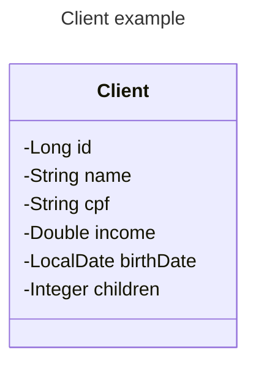

# Desafio03

Entregar um projeto Spring Boot contendo um CRUD completo de web services REST

* Busca paginada de recursos
* Busca de recurso por id
* Inserir novo recurso
* Atualizar recurso
* Deletar recurso

Um cliente possui nome, CPF, renda, data de nascimento, e quantidade de filhos. A especificação da
entidade Client é mostrada a seguir :

> ==o projeto deve conter um seed de pelo menos 10 clientes==

O projeto deverá tratar as seguintes exceções:

- Id não encontrado
- Erro de validação 422 :
	- Nome: não pode ser vazio
	- Data de nascimento: não pode ser data futura

